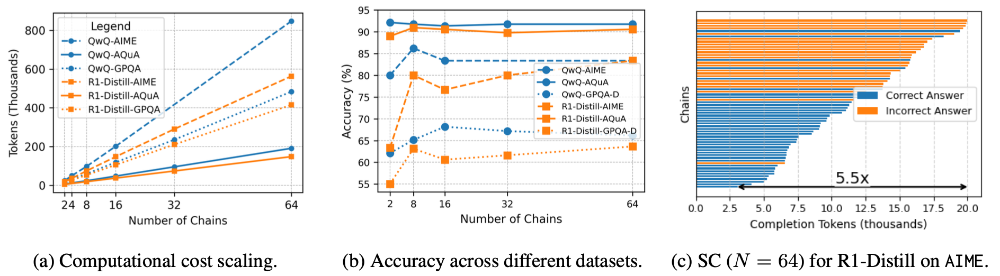
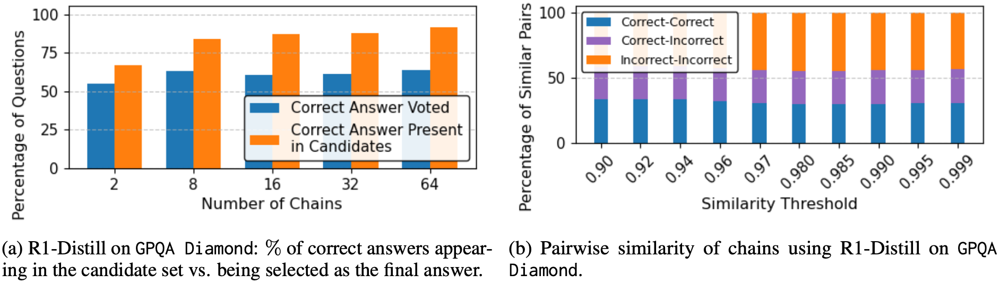
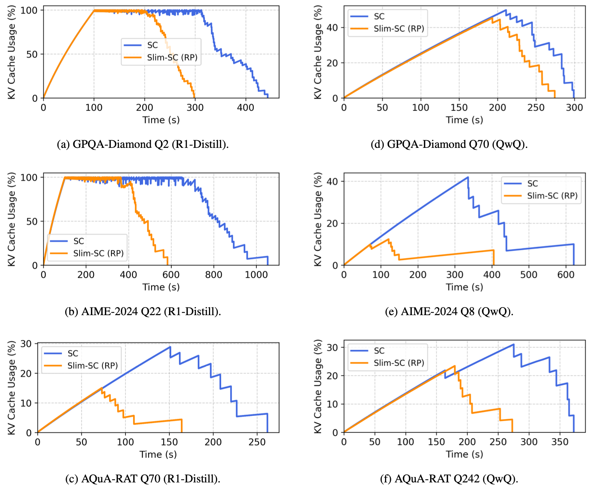
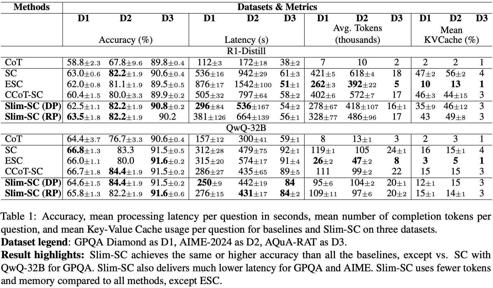

# Slim-SC: Thought Pruning for Efficient Scaling with Self-Consistency

This is the official repository for the EMNLP 2025 accepted paper **"Slim-SC: Thought Pruning for Efficient Scaling with Self-Consistency"**.

**[🔗 Paper on arXiv (coming soon)]**

## Abstract

Self-Consistency (SC) is a prominent Test-Time Scaling (TTS) technique that enhances the reasoning performance of Large Language Models (LLMs) by generating multiple reasoning chains and selecting the final answer via majority vote. While effective, this approach introduces substantial computational overhead, limiting its practical deployment. Our work provides the first theoretical and empirical analysis of the inefficiencies within SC, revealing that correct and incorrect reasoning chains form distinct semantic clusters. Building on this insight, we introduce **Slim-SC**, a step-wise thought pruning strategy that dynamically removes redundant chains based on inter-chain similarity at the thought level. By intelligently culling semantically similar (and often incorrect) chains during generation, Slim-SC not only reduces computational waste but also demonstrably matches or even improves the final accuracy over standard SC. Experiments on three mathematical reasoning benchmarks with two recent LLMs confirm that Slim-SC is a simple yet powerful method for efficient and accurate test-time scaling.

## The Key Idea: Pruning Redundancy to Improve Efficiency and Accuracy

### The Problem with Self-Consistency

Standard Self-Consistency (SC) suffers from three main issues:
1.  **High Computational Cost:** Generating N full reasoning chains scales cost and token usage linearly.
2.  **Diminishing Returns:** Accuracy gains plateau quickly as N increases, making the high cost less justifiable.
3.  **High Latency:** The system must wait for all N chains to complete, including slow, incorrect ones, before voting can occur.

<p align="center">
  
</p>
<p align="center">
  <em><b>Figure 1:</b> (a) Computational cost scales linearly with the number of chains. (b) Accuracy gains diminish, especially on easier datasets. (c) The system must wait for the longest chains, creating a latency bottleneck.</em>
</p>

### Our Motivation: The Opportunity in Redundancy

Our analysis reveals that the inefficiencies of SC present a clear opportunity for improvement:
1.  **Accuracy Gap:** There is a significant gap between the ideal accuracy (a correct answer is present) and the actual accuracy (the correct answer wins the vote). This suggests that incorrect chains often form larger consensus groups, outvoting the correct ones.
2.  **Semantic Clustering:** Correct and incorrect reasoning chains form distinct, well-separated semantic clusters. Incorrect chains tend to be more self-similar, forming denser clusters.

This clustering behavior is the key insight: **we can prune for redundancy to improve both efficiency and accuracy.** By removing chains that are semantically similar to others, we are more likely to remove a redundant incorrect chain than a unique correct one.

<p align="center">
  
</p>
<p align="center">
  <em><b>Figure 2:</b> (a) A persistent gap exists between a correct answer being present and it winning the vote. (b) Correct-correct (blue) and incorrect-incorrect (orange) pairs show high intra-cluster similarity, while correct-incorrect pairs (purple) are less similar, indicating distinct clusters.</em>
</p>

### The Solution: Slim-SC

Slim-SC is a dynamic, step-wise pruning algorithm that monitors all active reasoning chains as they are generated. Once two chains become highly similar at the thought level, one is pruned based on a defined strategy (e.g., random choice or diversity metric). This leads to significant efficiency gains by terminating redundant computations early.
<p align="center">

</p>
<p align="center">
<em><b>Figure 3:</b> Comparison of KV Cache usage over time for standard SC (blue) vs. Slim-SC (orange). Slim-SC releases GPU memory resources much faster by terminating redundant chains early.</em>
</p>

## Main Results

Slim-SC consistently matches or improves accuracy while substantially reducing latency, tokens, and memory usage compared to baselines.

<p align="center">
  
</p>
<p align="center">
  <em><b>Table 1:</b> Main experimental results comparing Slim-SC with baselines across various datasets and models. Slim-SC (RP/DP) achieves higher accuracy than efficiency-focused baselines (ESC, CCoT-SC) and significantly lower latency than standard SC.</em>
</p>

## Prerequisites

Before setting up the environment, please ensure you have the following ready:

**1. Log in to Hugging Face Hub**
You will need to download the model weights from the Hugging Face Hub. First, install the CLI and log in.
```bash
pip install -U "huggingface_hub[cli]"
huggingface-cli login
```

**2. Download Model Weights**
Download the two models used in our experiments to a local directory of your choice (e.g., `/path/to/your/models`).

```bash
# Download Qwen/QwQ-32B
huggingface-cli download Qwen/QwQ-32B --local-dir /path/to/your/models/Qwen-QwQ-32B

# Download deepseek-ai/DeepSeek-R1-Distill-Qwen-14B
huggingface-cli download deepseek-ai/DeepSeek-R1-Distill-Qwen-14B --local-dir /path/to/your/models/DeepSeek-R1-Distill-Qwen-14B
```

## Environment Setup

To reproduce our results, you will need a Python environment and a modified version of the vLLM inference server that logs KV cache usage. We provide two methods for setup: **Conda** (for manual setup) and **Docker/Singularity** (recommended for convenience).

### Method 1: Conda + Modified vLLM

**1. Create Conda Environment**
```bash
# Create a new conda environment
conda create -n slimsc python=3.12 -y

# Activate the environment
conda activate slimsc

# Install Python dependencies
pip install -r requirements/requirements.txt
```

**2. Install Modified vLLM**
This project requires a modified vLLM to log KV cache statistics. You can install it from our pre-forked repository.

```bash
# Clone the specific branch of our vLLM fork
git clone --branch colin_v0.10.1.1 https://github.com/googlercolin/vllm.git

# Navigate into the cloned directory
cd vllm

# Install in editable mode
# This command forces a build from source, which is required.
pip install -e .
```

### Method 2: Docker / Singularity (Recommended)
We provide pre-built container images with all dependencies. This is the simplest way to ensure a reproducible environment. You will need two images: one for the modified vLLM server and one for the evaluation client.

**For the vLLM Server with `CUDA_VERSION=12.2.2`:**
```bash
# Using Singularity (recommended for HPC)
singularity pull vllm_modified.sif docker://broccolin/vllm-nscc-edit:latest

# Using Docker
docker pull docker://broccolin/vllm-nscc-edit:latest
```

**For the Slim-SC Client:**
```bash
# Using Singularity (recommended for HPC)
singularity pull slimsc_client.sif docker://broccolin/slimsc:latest

# Using Docker
docker pull docker://broccolin/slimsc:latest
```

## Accessing and Reproducing Results

### Accessing Pre-computed Results (Table 1)
To facilitate analysis without requiring a full reproduction, the complete set of raw results, logs, and generated outputs for the experiments in our paper are available as a downloadable archive.

You can find the `slimsc-paper-results.zip` file on our **[GitHub Releases page](https://github.com/hyscale-lab/slimsc/releases)**.

### Reproducing Results from Scratch
This repository is configured for you to reproduce our findings from a clean slate. All output files will be generated in the `prune/results` directory automatically when you run the evaluation scripts.

The general workflow involves two steps:
1.  **Start the modified vLLM server** in one terminal.
2.  **Run the evaluation client script** in a second terminal.

### Hardware Configuration
Our experiments were conducted on **NVIDIA A100 40GB GPUs**. The number of GPUs required for the vLLM server depends on the model size:
-   **`DeepSeek-R1-Distill-Qwen-14B` (`R1-Distill-14B`):** This model requires **2 x A100 40GB GPUs**. Set `--tensor-parallel-size 2`.
-   **`Qwen-QwQ-32B` (`QwQ-32B`):** This model is larger and requires **4 x A100 40GB GPUs**. Set `--tensor-parallel-size 4`.

Please adjust the `CUDA_VISIBLE_DEVICES` and `--tensor-parallel-size` in the following commands accordingly.

### Hyperparameter Reference

Use the following tables from the paper for setting the correct parameters for each run.

**Table 7: Optimal N for Self-Consistency**
| Model | GPQA-Diamond | AIME'24 | AQuA-RAT |
| :--- | :---: | :---: | :---: |
| R1-Distill-14B | 64 | 64 | 8 |
| QwQ-32B | 16 | 8 | 8 |

**Table 8: Optimal Threshold for Slim-SC (DP)**
| Model | GPQA-Diamond | AIME'24 | AQuA-RAT |
| :--- | :---: | :---: | :---: |
| R1-Distill-14B | 0.95 | 0.95 | 0.95 |
| QwQ-32B | 0.95 | 0.98 | 0.98 |

**Table 9: Optimal Threshold for Slim-SC (RP)**
| Model | GPQA-Diamond | AIME'24 | AQuA-RAT |
| :--- | :---: | :---: | :---: |
| R1-Distill-14B | 0.98 | 0.98 | 0.98 |
| QwQ-32B | 0.98 | 0.98 | 0.98 |

---

### Step 1: Start the Modified vLLM Server

The server must be running before the client. **It is critical to set the `KVC_USAGE_FILE` environment variable correctly for each experiment.**

#### Using Conda
```bash
# 1. Activate your conda environment
conda activate slimsc

# 2. Set which GPUs the server will use (example for QwQ-32B)
export CUDA_VISIBLE_DEVICES=0,1,2,3

# 3. Set the KV cache log path based on the client's experiment parameters
# Example for an SC control run on AIME with QwQ-32B (N=8, run_index=1):
export KVC_USAGE_FILE="~/slimsc/prune/results/QwQ-32B/aime/sc_8_control/run1/kvcache_usages.csv"

# Example for a Slim-SC (random pruning) run on GPQA with R1-Distill-14B (N=64, thresh=0.98, delay=20):
# export KVC_USAGE_FILE="~/slimsc/prune/results/R1-Distill-14B/gpqa_diamond/random_n64_thresh0.98_delay20/run1/kvcache_usages.csv"

# 4. Create the directory for the log file
mkdir -p "$(dirname "$KVC_USAGE_FILE")"

# 5. Launch the server
vllm serve /path/to/your/Qwen-QwQ-32B \
    --tensor-parallel-size 4 \
    --port 8000
```

#### Using Singularity
```bash
# 1. Set which GPUs the server will use (example for QwQ-32B)
export CUDA_VISIBLE_DEVICES=0,1,2,3

# 2. Set the KV cache log path for the container
export SINGULARITYENV_KVC_USAGE_FILE="/results/QwQ-32B/aime/sc_8_control/run1/kvcache_usages.csv"
export SINGULARITYENV_CUDA_VISIBLE_DEVICES=$CUDA_VISIBLE_DEVICES

# 3. Create the directory on the host machine
mkdir -p "$(dirname "$HOME/slimsc/prune/results/QwQ-32B/aime/sc_8_control/run1/kvcache_usages.csv")"

# 4. Launch the server inside the container
singularity exec --nv \
    -B /path/to/your/models:/models \
    -B $HOME/slimsc/prune/results:/results \
    ./vllm_modified.sif \
    vllm serve /models/Qwen-QwQ-32B \
        --tensor-parallel-size 4 \
        --port 8000
```
> **Wait for the server to log "Application startup complete." before proceeding.**

---

### Step 2: Run the Evaluation Client

Open a **new terminal** for the client. The command will vary for each method.

#### A. CoT (Baseline)
The Chain-of-Thought baseline is equivalent to running SC with `N=1`.

<details><summary><b>Show Commands (Conda & Singularity)</b></summary>

**Using Conda:**
```bash
# In your NEW terminal
conda activate slimsc

python -m prune.evaluation.sc_control_eval \
    --n_start 1 \
    --model_name "QwQ-32B" \
    --model_identifier "/path/to/your/Qwen-QwQ-32B" \
    --tokenizer_path "/path/to/your/Qwen-QwQ-32B" \
    --dataset_name "aime" \
    --run_index 1 \
    --vllm_url "http://localhost:8000"
```

**Using Singularity:**
```bash
# In your NEW terminal
export SINGULARITYENV_VLLM_URL="http://localhost:8000"

singularity exec --nv \
    -B .:/app \
    -B /path/to/your/models:/models \
    -B $HOME/slimsc/prune/results:/results \
    ./slimsc_client.sif \
    python -m prune.evaluation.sc_control_eval \
        --n_start 1 \
        --model_name "QwQ-32B" \
        --model_identifier "/models/Qwen-QwQ-32B" \
        --tokenizer_path "/models/Qwen-QwQ-32B" \
        --dataset_name "aime" \
        --run_index 1 \
        --output_dir "/results"
```
> **Note:** For this to work, the server's `KVC_USAGE_FILE` must be set for the `sc_1_control` run.

</details>

#### B. Standard Self-Consistency (SC Control)

This run establishes the baseline performance for standard SC. Use the optimal `N` from **Table 7**.

<details><summary><b>Show Commands (Conda & Singularity)</b></summary>

**Example: `QwQ-32B` on `AIME` (`N=8` from Table 7)**

**Using Conda:**
```bash
# In your NEW terminal
conda activate slimsc

python -m prune.evaluation.sc_control_eval \
    --n_start 8 \
    --model_name "QwQ-32B" \
    --model_identifier "/path/to/your/Qwen-QwQ-32B" \
    --tokenizer_path "/path/to/your/Qwen-QwQ-32B" \
    --dataset_name "aime" \
    --run_index 1 \
    --vllm_url "http://localhost:8000"
```

**Using Singularity:**
```bash
# In your NEW terminal
export SINGULARITYENV_VLLM_URL="http://localhost:8000"

singularity exec --nv \
    -B .:/app \
    -B /path/to/your/models:/models \
    -B $HOME/slimsc/prune/results:/results \
    ./slimsc_client.sif \
    python -m prune.evaluation.sc_control_eval \
        --n_start 8 \
        --model_name "QwQ-32B" \
        --model_identifier "/models/Qwen-QwQ-32B" \
        --tokenizer_path "/models/Qwen-QwQ-32B" \
        --dataset_name "aime" \
        --run_index 1 \
        --output_dir "/results"
```
> **Note:** The server's `KVC_USAGE_FILE` must be set to the path for the `sc_8_control` run.

</details>

#### C. Slim-SC (Random Pruning - RP)

This runs our proposed method with the simple and effective Random Pruning strategy. Use `N` from **Table 7** and `threshold` from **Table 9**.

<details><summary><b>Show Commands (Conda & Singularity)</b></summary>

**Example: `R1-Distill-14B` on `GPQA` (`N=64`, `threshold=0.98`)**

**Using Conda:**
```bash
# In your NEW terminal
conda activate slimsc

# The client needs one GPU for the sentence-transformer embedding model
export CUDA_VISIBLE_DEVICES=2 # Use a GPU not used by the server

python -m prune.evaluation.similarity_prune_eval \
    --n_start 64 \
    --threshold 0.98 \
    --pruning_strategy "random" \
    --num_steps_to_delay_pruning 20 \
    --model_name "R1-Distill-14B" \
    --model_identifier "/path/to/your/DeepSeek-R1-Distill-Qwen-14B" \
    --tokenizer_path "/path/to/your/DeepSeek-R1-Distill-Qwen-14B" \
    --dataset_name "gpqa_diamond" \
    --run_index 1 \
    --vllm_url "http://localhost:8000"
```

**Using Singularity:**
```bash
# In your NEW terminal
export CUDA_VISIBLE_DEVICES=2 # Use a GPU not used by the server
export SINGULARITYENV_VLLM_URL="http://localhost:8000"
export SINGULARITYENV_CUDA_VISIBLE_DEVICES=$CUDA_VISIBLE_DEVICES

singularity exec --nv \
    -B .:/app \
    -B /path/to/your/models:/models \
    -B $HOME/slimsc/prune/results:/results \
    -B $HOME/.cache/huggingface:/root/.cache/huggingface \
    ./slimsc_client.sif \
    python -m prune.evaluation.similarity_prune_eval \
        --n_start 64 \
        --threshold 0.98 \
        --pruning_strategy "random" \
        --num_steps_to_delay_pruning 20 \
        --model_name "R1-Distill-14B" \
        --model_identifier "/models/DeepSeek-R1-Distill-Qwen-14B" \
        --tokenizer_path "/models/DeepSeek-R1-Distill-Qwen-14B" \
        --dataset_name "gpqa_diamond" \
        --run_index 1 \
        --output_dir "/results"
```
> **Note:** The server's `KVC_USAGE_FILE` must be set to the path for the `random_n64_thresh0.98_delay20` run.

</details>

---

### Step 3: View Results

Results for each run are saved in the `output_dir`. The structure is:
`<output_dir>/<model_name>/<dataset_name>/<run_name>/run<run_index>/`

-   `evaluation_summary.csv`: Per-question metrics for the run.
-   `aggregated_metrics.json`: The overall aggregated metrics for that single run.
-   `mean_aggregated_metrics.json`: **This file, located in the `<run_name>` parent directory, contains the final averaged metrics across all runs (e.g., `run1`, `run2`, `run3`). These are the values that correspond to Table 1.**

## Citation
If you find our work useful, please cite our paper:
```bibtex
@misc{hong2025slimsc,
      title={Slim-SC: Thought Pruning for Efficient Scaling with Self-Consistency}, 
      author={Colin Hong Fung Heng and Xu Guo and Anand Chaanan Singh and Esha Choukse and Dmitrii Ustiugov},
      year={2025},
      eprint={...},
      archivePrefix={arXiv},
      primaryClass={cs.CL}
}
```