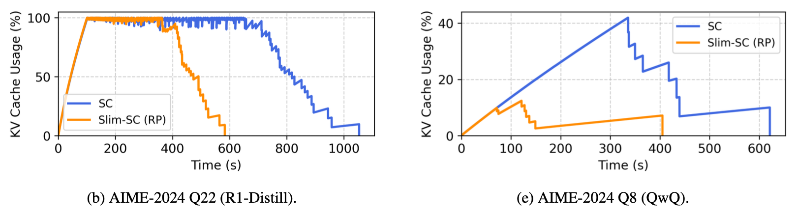

# Slim-SC: Thought Pruning for Efficient Scaling with Self-Consistency

This is the official repository for the EMNLP 2025 accepted paper **"Slim-SC: Thought Pruning for Efficient Scaling with Self-Consistency"**.

**[🔗 Paper on arXiv (coming soon)]**

## Overview

Standard Self-Consistency (SC) improves LLM reasoning but is computationally expensive and slow due to generating many full reasoning chains. Our analysis reveals that correct and incorrect chains form distinct semantic clusters, with incorrect chains often being highly redundant. We propose **Slim-SC**, a dynamic thought-pruning method that identifies and removes these redundant chains step-by-step during generation based on their semantic similarity. Our method achieves significant efficiency gains, **reducing end-to-end latency by up to 45%** (on GPQA) and **token usage by up to 32%** (on AIME-2024), while also **lowering mean KV Cache usage by 10pp**. Crucially, these gains are achieved while maintaining or even slightly improving accuracy (**+0.5pp on GPQA**) by retaining a more effective set of diverse candidate chains for the final vote.

<p align="center">
  
</p>
<p align="center">
  <em><b>Figure 1:</b> Comparison of KV Cache usage over time for standard SC (blue) vs. Slim-SC (orange). Slim-SC releases GPU memory resources much faster by terminating redundant chains early.</em>
</p>

## Prerequisites

Before setting up the environment, please ensure you have the following ready:

**1. Log in to HuggingFace Hub**
You will need to download the model weights from the HuggingFace Hub. First, install the CLI and log in.
```bash
pip install -U "huggingface_hub[cli]"
huggingface-cli login
```

**2. Download Model Weights**
Download the two models used in our experiments to a local directory of your choice (e.g., `/path/to/your/models`).

```bash
# Download Qwen/QwQ-32B
huggingface-cli download Qwen/QwQ-32B --local-dir /path/to/your/models/Qwen-QwQ-32B

# Download deepseek-ai/DeepSeek-R1-Distill-Qwen-14B
huggingface-cli download deepseek-ai/DeepSeek-R1-Distill-Qwen-14B --local-dir /path/to/your/models/DeepSeek-R1-Distill-Qwen-14B
```

## Environment Setup

To reproduce our results, you will need a Python environment and a modified version of the vLLM inference server that logs KV cache usage.

### Method 1: Docker / Singularity (Recommended)
We provide pre-built container images with all dependencies. This is the simplest way to ensure a reproducible environment. You will need two images: one for the modified vLLM server and one for the evaluation client.

**For the vLLM Server:**
The server image contains the modified vLLM build.
```bash
# Using Singularity (recommended for HPC)
singularity pull vllm_modified.sif docker://broccolin/vllm-nscc-edit:latest

# Using Docker
docker pull docker://broccolin/vllm-nscc-edit:latest
```

**For the Slim-SC Client:**
The client image contains this repository's code and dependencies.
```bash
# Using Singularity (recommended for HPC)
singularity pull slimsc_client.sif docker://broccolin/slimsc:latest

# Using Docker
docker pull docker://broccolin/slimsc:latest
```

### Method 2: Conda + Modified vLLM

**1. Create Conda Environment**
```bash
# Create a new conda environment
conda create -n slimsc python=3.12 -y

# Activate the environment
conda activate slimsc

# Install Python dependencies
pip install -r requirements/requirements.txt
```

**2. Install Modified vLLM**
This project requires a modified vLLM to log KV cache statistics. You can install it from our pre-forked repository.

```bash
# Clone the specific branch of our vLLM fork
git clone --branch colin_v0.10.1.1 https://github.com/googlercolin/vllm.git

# Navigate into the cloned directory
cd vllm

# Install in editable mode
pip install -e .
```

## Reproducing Main Results

This section provides a step-by-step guide to reproduce the main results from our paper, shown below.

<p align="center">
  
</p>
<p align="center">
  <em><b>Table 1:</b> Main experimental results comparing Slim-SC with baselines.</em>
</p>

### Hardware Configuration
Our experiments were conducted on a system running **Ubuntu 22.04** with **CUDA 12.2** and **NVIDIA A100 40GB GPUs**. The provided Docker/Singularity containers are also built on this stack to ensure environment consistency.

The number of GPUs required for the vLLM server depends on the model size:
-   **`DeepSeek-R1-Distill-Qwen-14B` (`R1-Distill-14B`):** This model requires **2 x A100 40GB GPUs**. Set `--tensor-parallel-size 2`.
-   **`Qwen-QwQ-32B` (`QwQ-32B`):** This model is larger and requires **4 x A100 40GB GPUs**. Set `--tensor-parallel-size 4`.

Please adjust the `CUDA_VISIBLE_DEVICES` and `--tensor-parallel-size` in the following commands accordingly.

### Hyperparameter Reference

Use the following tables from the paper for setting the correct parameters for each run.

**Table 7: Optimal N for Self-Consistency**
| Model | GPQA-Diamond | AIME'24 | AQuA-RAT |
| :--- | :---: | :---: | :---: |
| R1-Distill-14B | 64 | 64 | 8 |
| QwQ-32B | 16 | 8 | 8 |

**Table 8: Optimal Threshold for Slim-SC (DP)**
| Model | GPQA-Diamond | AIME'24 | AQuA-RAT |
| :--- | :---: | :---: | :---: |
| R1-Distill-14B | 0.95 | 0.95 | 0.95 |
| QwQ-32B | 0.95 | 0.98 | 0.98 |

**Table 9: Optimal Threshold for Slim-SC (RP)**
| Model | GPQA-Diamond | AIME'24 | AQuA-RAT |
| :--- | :---: | :---: | :---: |
| R1-Distill-14B | 0.98 | 0.98 | 0.98 |
| QwQ-32B | 0.98 | 0.98 | 0.98 |

---

### Step 1: Start the Modified vLLM Server

The server must be running before the client. **It is critical to set the `KVC_USAGE_FILE` environment variable correctly for each experiment.**

#### Using Singularity (Recommended)
```bash
# 1. Set which GPUs the server will use (example for R1-Distill-14B)
export CUDA_VISIBLE_DEVICES=0,1

# 2. Set the KV cache log path for the container. The path structure depends on the evaluation type.
# Example for a Slim-SC (random pruning) run:
export SINGULARITYENV_KVC_USAGE_FILE="/results/R1-Distill-14B/gpqa_diamond/random_n64_thresh0.98_delay20/run1/kvcache_usages.csv"
export SINGULARITYENV_CUDA_VISIBLE_DEVICES=$CUDA_VISIBLE_DEVICES

# 3. Create the corresponding directory on the host machine
mkdir -p "$HOME/slimsc/prune/results/R1-Distill-14B/gpqa_diamond/random_n64_thresh0.98_delay20/run1"

# 4. Launch the server inside the container
singularity exec --nv \
    -B /path/to/your/models:/models \
    -B $HOME/slimsc/prune/results:/results \
    ./vllm_modified.sif \
    vllm serve /models/DeepSeek-R1-Distill-Qwen-14B \
        --tensor-parallel-size 2 \
        --port 8000
```
> **Wait for the server to log "Application startup complete." before proceeding.**

#### Using Conda
```bash
# 1. Activate your conda environment
conda activate slimsc

# 2. Set which GPUs the server will use (example for R1-Distill-14B)
export CUDA_VISIBLE_DEVICES=0,1

# 3. Set the KV cache log path.
# Example for a Slim-SC (random pruning) run on GPQA with R1-Distill-14B:
export KVC_USAGE_FILE="~/slimsc/prune/results/R1-Distill-14B/gpqa_diamond/random_n64_thresh0.98_delay20/run1/kvcache_usages.csv"

# 4. Create the directory for the log file
mkdir -p "$(dirname "$KVC_USAGE_FILE")"

# 5. Launch the server
vllm serve /path/to/your/models/DeepSeek-R1-Distill-Qwen-14B \
    --tensor-parallel-size 2 \
    --port 8000
```
> **Wait for the server to log "Application startup complete." before proceeding.**

---

### Step 2: Run the Evaluation Client

Open a **new terminal** for the client. The command will vary for each method.

#### A. CoT (Baseline)
The Chain-of-Thought baseline is equivalent to running SC with `N=1`.

<details><summary><b>Show Commands (Singularity & Conda)</b></summary>

**Using Singularity:**
```bash
# In your NEW terminal
export SINGULARITYENV_VLLM_URL="http://localhost:8000"

singularity exec --nv \
    -B .:/app \
    -B /path/to/your/models:/models \
    -B $HOME/slimsc/prune/results:/results \
    ./slimsc_client.sif \
    python -m prune.evaluation.sc_control_eval \
        --n_start 1 \
        --model_name "QwQ-32B" \
        --model_identifier "/models/Qwen-QwQ-32B" \
        --tokenizer_path "/models/Qwen-QwQ-32B" \
        --dataset_name "aime" \
        --run_index 1 \
        --output_dir "/results"
```

**Using Conda:**
```bash
# In your NEW terminal
conda activate slimsc

python -m prune.evaluation.sc_control_eval \
    --n_start 1 \
    --model_name "QwQ-32B" \
    --model_identifier "/path/to/your/models/Qwen-QwQ-32B" \
    --tokenizer_path "/path/to/your/models/Qwen-QwQ-32B" \
    --dataset_name "aime" \
    --run_index 1 \
    --vllm_url "http://localhost:8000"
```
> **Note:** For this to work, the server's `KVC_USAGE_FILE` must be set for the `sc_1_control` run.

</details>

#### B. Standard Self-Consistency (SC Control)

This run establishes the baseline performance for standard SC. Use the optimal `N` from **Table 7**.

<details><summary><b>Show Commands (Singularity & Conda)</b></summary>

**Example: `QwQ-32B` on `AIME` (`N=8` from Table 7)**

**Using Singularity:**
```bash
# In your NEW terminal
export SINGULARITYENV_VLLM_URL="http://localhost:8000"

singularity exec --nv \
    -B .:/app \
    -B /path/to/your/models:/models \
    -B $HOME/slimsc/prune/results:/results \
    ./slimsc_client.sif \
    python -m prune.evaluation.sc_control_eval \
        --n_start 8 \
        --model_name "QwQ-32B" \
        --model_identifier "/models/Qwen-QwQ-32B" \
        --tokenizer_path "/models/Qwen-QwQ-32B" \
        --dataset_name "aime" \
        --run_index 1 \
        --output_dir "/results"
```
**Using Conda:**
```bash
# In your NEW terminal
conda activate slimsc

python -m prune.evaluation.sc_control_eval \
    --n_start 8 \
    --model_name "QwQ-32B" \
    --model_identifier "/path/to/your/models/Qwen-QwQ-32B" \
    --tokenizer_path "/path/to/your/models/Qwen-QwQ-32B" \
    --dataset_name "aime" \
    --run_index 1 \
    --vllm_url "http://localhost:8000"
```
> **Note:** The server's `KVC_USAGE_FILE` must be set to the path for the `sc_8_control` run.

</details>

#### C. Slim-SC (Random Pruning - RP)

This runs our proposed method with the simple and effective Random Pruning strategy. Use `N` from **Table 7** and `threshold` from **Table 9**.

<details><summary><b>Show Commands (Singularity & Conda)</b></summary>

**Example: `R1-Distill-14B` on `GPQA` (`N=64`, `threshold=0.98`)**

**Using Singularity:**
```bash
# In your NEW terminal
export CUDA_VISIBLE_DEVICES=2 # Use a GPU not used by the server
export SINGULARITYENV_VLLM_URL="http://localhost:8000"
export SINGULARITYENV_CUDA_VISIBLE_DEVICES=$CUDA_VISIBLE_DEVICES

singularity exec --nv \
    -B .:/app \
    -B /path/to/your/models:/models \
    -B $HOME/slimsc/prune/results:/results \
    -B $HOME/.cache/huggingface:/root/.cache/huggingface \
    ./slimsc_client.sif \
    python -m prune.evaluation.similarity_prune_eval \
        --n_start 64 \
        --threshold 0.98 \
        --pruning_strategy "random" \
        --num_steps_to_delay_pruning 20 \
        --model_name "R1-Distill-14B" \
        --model_identifier "/models/DeepSeek-R1-Distill-Qwen-14B" \
        --tokenizer_path "/models/DeepSeek-R1-Distill-Qwen-14B" \
        --dataset_name "gpqa_diamond" \
        --run_index 1 \
        --output_dir "/results"
```
**Using Conda:**
```bash
# In your NEW terminal
conda activate slimsc

# The client needs one GPU for the sentence-transformer embedding model
export CUDA_VISIBLE_DEVICES=2 # Use a GPU not used by the server

python -m prune.evaluation.similarity_prune_eval \
    --n_start 64 \
    --threshold 0.98 \
    --pruning_strategy "random" \
    --num_steps_to_delay_pruning 20 \
    --model_name "R1-Distill-14B" \
    --model_identifier "/path/to/your/models/DeepSeek-R1-Distill-Qwen-14B" \
    --tokenizer_path "/path/to/your/models/DeepSeek-R1-Distill-Qwen-14B" \
    --dataset_name "gpqa_diamond" \
    --run_index 1 \
    --vllm_url "http://localhost:8000"
```
> **Note:** The server's `KVC_USAGE_FILE` must be set to the path for the `random_n64_thresh0.98_delay20` run, as shown in the server setup example.

</details>

---

### Step 3: View Results

Results for each run are saved in the `output_dir`. The structure is:
`<output_dir>/<model_name>/<dataset_name>/<run_name>/run<run_index>/`

-   `evaluation_summary.csv`: Per-question metrics for the run.
-   `aggregated_metrics.json`: The overall aggregated metrics for that single run.
-   `mean_aggregated_metrics.json`: **This file, located in the `<run_name>` parent directory, contains the final averaged metrics across all runs (e.g., `run1`, `run2`, `run3`). These are the values that correspond to Table 1.**

## Troubleshooting & Resuming Incomplete Runs
Experiments can sometimes be interrupted (e.g., due to GPU time limits). Our evaluation scripts are designed to be resumable. If a run is incomplete, you can clean up the partial results for the failed questions and rerun the same command to finish the job.

**Step 1: Identify Incomplete Questions**

First, find which questions did not complete by checking the `evaluation_summary.csv` file for that run. Incomplete questions will have a missing value in the `voted_answer` column. You can identify them with this short Python script:
```python
import pandas as pd

# Replace with the actual path to your CSV file
csv_path = 'prune/results/R1-Distill-14B/gpqa_diamond/random_n64_thresh0.98_delay20/run1/evaluation_summary.csv'

df = pd.read_csv(csv_path)
incomplete_qns = df[df['voted_answer'].isnull()]['iteration'].tolist()

if incomplete_qns:
    print(f"Incomplete question iterations found: {incomplete_qns}")
else:
    print("No incomplete questions found.")
```

**Step 2: Clean Up Partial Files**

Once you have the list of iteration numbers (e.g., `[85, 92]`), you must remove all partial files associated with them.

```bash
# 1. Set the base path to your specific run directory
RUN_DIR="prune/results/R1-Distill-14B/gpqa_diamond/random_n64_thresh0.98_delay20/run1"

# 2. List the iteration numbers that failed
FAILED_QNS=(85 92) # Example numbers from Step 1

# 3. Loop and remove the files
for QN in "${FAILED_QNS[@]}"; do
    echo "Cleaning up files for question $QN..."
    # Remove chain outputs (uses wildcard)
    rm -f "${RUN_DIR}/individual_chains/question_${QN}_chain_"*.txt
    # Remove summary JSON
    rm -f "${RUN_DIR}/summaries/question_${QN}_summary.json"
done

# 4. Finally, open the evaluation_summary.csv file in a text editor or spreadsheet
#    program and manually delete the rows corresponding to the FAILED_QNS.
```

**Step 3: Rerun the Evaluation**

Rerun the **exact same evaluation command** you used originally. The script will automatically detect the missing questions in the `evaluation_summary.csv` file and will only run those, appending the new results upon completion.

## License
This project is licensed under the terms of the MIT License. See the [LICENSE](LICENSE.md) file for details.

## Citation
If you find our work useful, please cite our paper:
```bibtex
@inproceedings{hong2025slimsc,
      title={Slim-SC: Thought Pruning for Efficient Scaling with Self-Consistency}, 
      author={Colin Hong, and Xu Guo, and Anand Chaanan Singh, and Esha Choukse, and Dmitrii Ustiugov},
      booktitle={Proceedings of the 2025 Conference on Empirical Methods in Natural Language Processing (EMNLP)},
      year={2025},
}
}
```